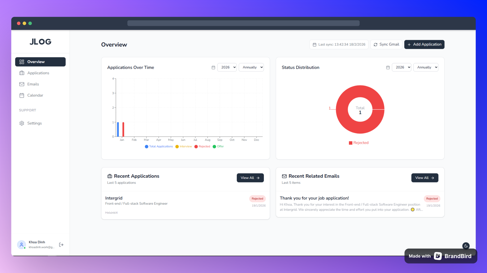
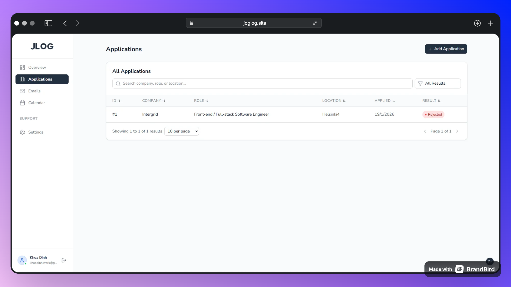
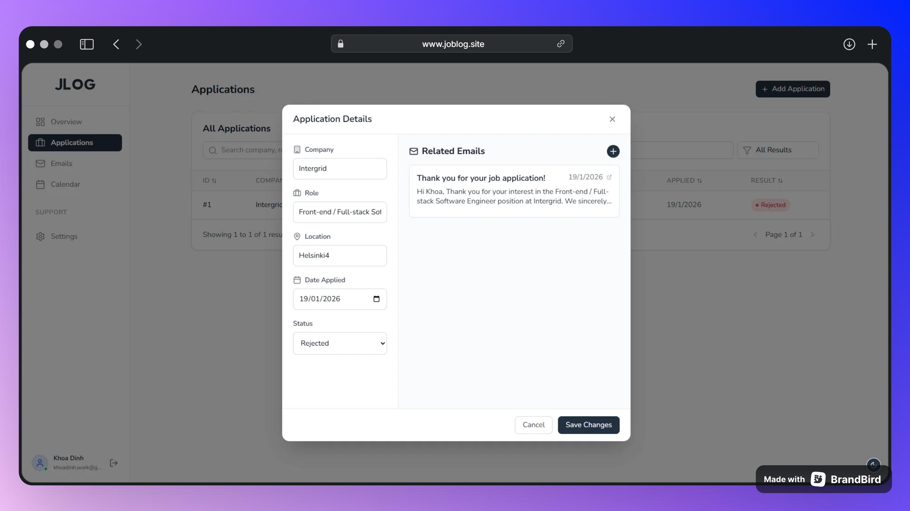

# JLog - Job Application Tracker UI

Welcome to JLog (Job Log), a modern and efficient application for tracking your job search process. Keep all your applications organized, monitor your progress with visual analytics, and manage related communications in one place.

## Features

- **Dashboard Overview**: Get a bird's-eye view of your job search with insightful charts and statistics. Track applications over time and see status distributions.
- **Application Management**: Easily add, view, and manage all your job applications in a clean, searchable list view.
- **Detailed Tracking**: Dive deep into each application with dedicated detail views. Record update history, notes, and related emails.
- **Email Integration**: Link and view related emails for each application directly within the tracking interface.
- **Dark Mode Support**: Seamlessly switch between light and dark themes for comfortable usage at any time of day.
- **Responsive Design**: Fully responsive interface that works on desktop and tablet.

## Screenshots

### Dashboard Overview


### Applications List


### Application Details


## Tech Stack

Built with a modern stack for performance and developer experience:

- **Framework**: [React](https://react.dev/) + [Vite](https://vitejs.dev/)
- **Styling**: [Tailwind CSS v4](https://tailwindcss.com/)
- **UI Components**: [Radix UI](https://www.radix-ui.com/)
- **Charts**: [Recharts](https://recharts.org/)
- **State Management**: [React Query](https://tanstack.com/query/latest)
- **Routing**: [React Router](https://reactrouter.com/)
- **Icons**: [Lucide React](https://lucide.dev/)

## Getting Started

Follow these steps to set up the project locally:

1.  **Clone the repository:**
    ```bash
    git clone https://github.com/t0dida00/OfferFlow.git
    cd OfferFlow
    ```

2.  **Install dependencies:**
    ```bash
    npm install
    ```

3.  **Start the development server:**
    ```bash
    npm run dev
    ```

4.  Open your browser and navigate to `http://localhost:5173` (or the port shown in your terminal).

## Building for Production

To create a production build:

```bash
npm run build
```

The output will be in the `dist` directory.

## License

This project is licensed under the MIT License.